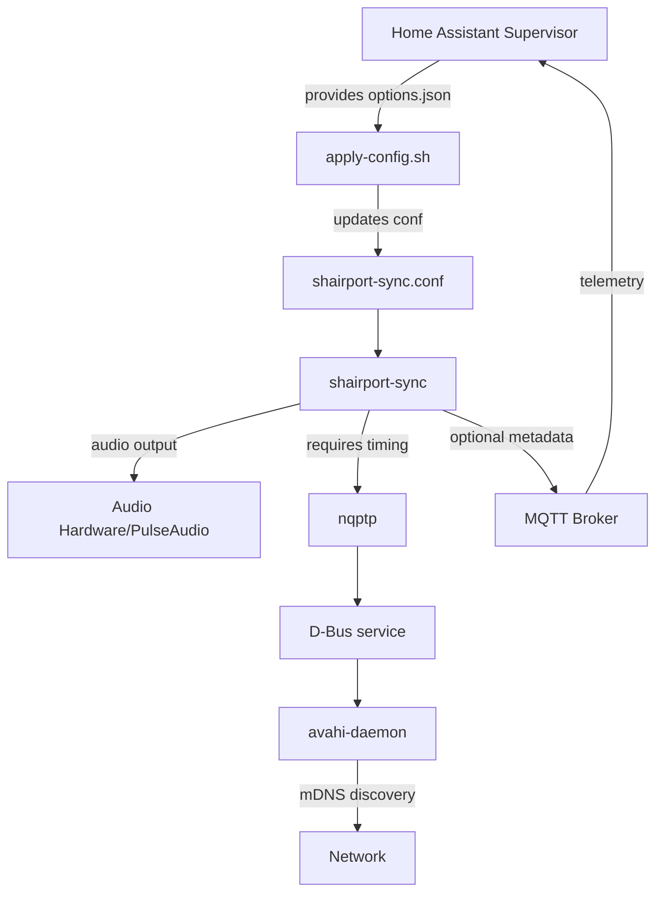

# Project Context

## Purpose

This Home Assistant add-on transforms the host system into an AirPlay 2 receiver, enabling users to stream audio from Apple devices (iPhone, iPad, Mac) to speakers connected to their Home Assistant setup. Built on the robust [Shairport Sync](https://github.com/mikebrady/shairport-sync) library, it provides seamless AirPlay 2 compatibility with optional MQTT integration for Home Assistant automations and status monitoring.

**Key Goals:**
- Provide reliable AirPlay 2 audio streaming to Home Assistant systems
- Support multi-architecture deployments (aarch64, amd64, armv7, i386, armhf)
- Enable ecosystem integration through MQTT telemetry (artist, album, playback state)
- Maintain compatibility with Home Assistant add-on conventions

## Tech Stack

### Container & Build System
- **Base Image**: Debian bookworm-slim
- **Build System**: Multi-stage Dockerfile with builder pattern
- **Container Runtime**: Home Assistant Supervisor-managed Docker container
- **Architecture Support**: aarch64, amd64, armv7, i386, armhf

### Core Dependencies
- **Shairport Sync**: AirPlay 2 receiver (compiled with `--with-airplay-2`, `--with-pa`, `--with-mqtt-client`, `--with-avahi`, `--with-apple-alac`, `--with-soxr`)
- **nqptp**: Network Quality Protocol Time Protocol for precise audio synchronization
- **ALAC**: Apple Lossless Audio Codec decoder
- **Supervisor**: Process orchestration and dependency management
- **Avahi**: mDNS/DNS-SD service discovery
- **D-Bus**: Inter-process communication bus
- **PulseAudio**: Default audio backend (`pa`), with ALSA fallback support
- **MQTT Client**: Optional telemetry publishing via libmosquitto

### Configuration & Scripting
- **Languages**: Bash scripts for configuration management
- **Tools**: `jq` for JSON parsing, `sed` for config templating
- **Key Scripts**:
  - [`apply-config.sh`](apply-config.sh) - Reads `/data/options.json` and updates [`shairport-sync.conf`](shairport-sync.conf)
  - [`start-dbus.sh`](start-dbus.sh) - Initializes D-Bus service
- **Config Files**:
  - [`config.yaml`](config.yaml) - Home Assistant add-on manifest with schema
  - [`shairport-sync.conf`](shairport-sync.conf) - Shairport Sync runtime configuration
  - [`supervisord.conf`](supervisord.conf) - Service orchestration with dependency ordering

## Project Conventions

### Code Style
- **Shell Scripts**: 
  - Use `bash` with implicit error handling expectations
  - Variable naming: lowercase `snake_case`
  - Indentation: 2 spaces
  - Include inline comments referencing upstream defaults
  - Escape special characters (`\`, `$`) when building sed patterns
- **Configuration Files**:
  - YAML: 2-space indentation, aligned key-value pairs
  - Shairport config: C-style comments with `//`, preserve upstream structure

### Architecture Patterns

**Service Startup Order** (managed by Supervisor):
1. `apply-config` (priority 500) - One-shot configuration update
2. `nqptp` (priority 600) - Timing service
3. `dbus` (priority 700) - IPC bus
4. `avahi-daemon` (priority 800, 5s delay) - Service discovery
5. `shairport-sync` (priority 900, 8s delay) - AirPlay receiver

**Key Principles**:
- **Host Network Mode**: Required for mDNS discovery and audio access
- **Idempotent Configuration**: `apply-config.sh` can run multiple times safely
- **Graceful Degradation**: MQTT and advanced audio features are optional
- **Supervisor Orchestration**: All services auto-restart on failure

### Testing Strategy

**Manual Validation** (no automated CI due to hardware dependencies):
1. Deploy add-on to Home Assistant instance
2. Verify AirPlay receiver appears on Apple devices
3. Test audio playback from iOS/macOS device
4. Validate MQTT telemetry (if enabled) in Home Assistant
5. Test configuration changes via Home Assistant UI
6. Verify service recovery after container restart

**Test Scenarios**:
- Basic playback (iPhone → Home Assistant)
- Volume control and mute functionality
- MQTT metadata publishing (artist, album, title)
- Multi-device switching
- Network interruption recovery
- Configuration hot-reload

### Git Workflow

**GitFlow Strategy**:
- **`main`**: Production releases, tagged with semantic versions (`v0.1.5`)
- **Feature Branches**: `feature/description` for new capabilities
- **Fix Branches**: `fix/description` for bug fixes
- **Release Process**:
  1. Create PR to `main` with version bump in [`config.yaml`](config.yaml)
  2. Review changes, test deployment
  3. Merge to `main` and tag commit as `vX.Y.Z`
  4. GitHub Actions (if configured) builds multi-arch images

**Commit Conventions**:
- Use descriptive commit messages
- Reference issue numbers when applicable
- Version bumps in separate commits

## Domain Context

### Home Assistant Ecosystem Integration

This add-on integrates deeply with the Home Assistant ecosystem:

**Add-on Lifecycle**:
- Managed by Home Assistant Supervisor
- Configuration exposed via Home Assistant UI (Options tab)
- User options serialized to `/data/options.json` at runtime
- Logs accessible via Home Assistant UI

**MQTT Integration** (optional):
- Publishes metadata to `airplay2` topic (configurable)
- Enables automations based on playback state:
  - `play_start` / `play_end` / `play_flush` / `play_resume`
  - `artist`, `album`, `title`, `genre`, `volume`, `client_ip`
- Remote control via MQTT commands (`play`, `pause`, `volumeup`, etc.)

**Audio Pipeline**:
- Default: PulseAudio (`pa`) backend for compatibility
- Alternative: ALSA (`alsa`) for direct hardware access
- Configurable via [`config.yaml`](config.yaml:25) `output_backend` option

### Network Requirements

- **mDNS/Bonjour**: Avahi advertises `_airplay._tcp` service
- **Port Requirements**: 
  - AirPlay 2: Port 7000 (TCP)
  - UDP port range: 6001-6010 (configurable)
- **Host Networking**: Required for proper mDNS functionality

## Important Constraints

### Technical Constraints

1. **Debian Base Image**: Larger image size (~500MB) vs Alpine, but ensures:
   - Compatible system libraries for Shairport Sync compilation
   - Reliable PulseAudio and Avahi integration
   - Consistent behavior across architectures

2. **Host Network Requirement**: 
   - No port mapping isolation
   - Direct access to host audio hardware
   - Required for mDNS/Bonjour discovery

3. **Audio Permissions**: 
   - Container requires `audio: true` in [`config.yaml`](config.yaml:15)
   - Access to host audio devices

4. **Timing Precision**: 
   - `nqptp` must run continuously for sync accuracy
   - Service delays (5s, 8s) ensure proper initialization order
   - Network jitter can affect playback quality

### Operational Constraints

1. **Manual Testing**: No CI/CD automation due to:
   - Audio hardware requirements
   - Apple device dependencies for AirPlay testing
   - Home Assistant runtime environment needs

2. **Configuration Complexity**: 
   - 20+ optional parameters in [`config.yaml`](config.yaml:27)
   - Line-number-based sed replacements in [`apply-config.sh`](apply-config.sh)
   - Breaking changes if Shairport config structure changes

3. **MQTT Security**: 
   - Credentials stored in Home Assistant options
   - Password field type in schema provides UI masking
   - No built-in certificate management for TLS

## External Dependencies

### Required Services

1. **Home Assistant Supervisor**
   - Provides `/data/options.json` contract
   - Manages container lifecycle
   - Exposes configuration UI

2. **Avahi Daemon**
   - Built into container
   - Requires D-Bus service
   - Advertises AirPlay service via mDNS

3. **Audio Hardware/PulseAudio**
   - Host audio system (ALSA/PulseAudio)
   - Must be accessible via `audio: true` permission

### Optional Services

1. **MQTT Broker** (typically `core-mosquitto`)
   - Default hostname: `core-mosquitto`
   - Port: 1883 (configurable)
   - Required for telemetry and remote control features
   - Credentials configured via [`config.yaml`](config.yaml:22)

2. **Apple Devices**
   - iOS, iPadOS, macOS devices as AirPlay sources
   - Requires devices on same network

### Upstream Dependencies

1. **Shairport Sync** ([mikebrady/shairport-sync](https://github.com/mikebrady/shairport-sync))
   - Version: Latest from `main` branch during build
   - Critical for AirPlay 2 protocol implementation

2. **nqptp** ([mikebrady/nqptp](https://github.com/mikebrady/nqptp))
   - Version: Latest from `main` branch during build
   - Provides precise timing for audio synchronization

3. **ALAC** ([mikebrady/alac](https://github.com/mikebrady/alac))
   - Apple Lossless Audio Codec decoder
   - Built and linked during compilation
